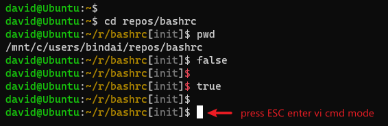

# bashrc

祖传的 .bashrc 文件

## quick start

```bash
git clone https://github.com/bingzhangdai/bashrc.git
source bashrc/.bashrc
```

## key points

* bash：发行版自带 bash，远端服务器有时也不能更改终端，不想让远端和本地的使用习惯有不一致

* 快：在功能丰富与性能之间做出良好的平衡，所有功能尽量以 shell 脚本的方式实现，避免启动新进程

* 在便捷性，操作快捷上尽量与 zsh 靠近

* 素雅的命令提示符，最短的 prompt 提供尽可能多的信息

## cheatsheet

### 命令提示符



* 素雅：避免过于花哨的界面让人分不清主次

* 速度：即使在WSL上也不能卡（[原因](https://github.com/microsoft/WSL/issues/4197)），按回车一定要流畅

* 精简：不能占用太多空间，同屏/同行看到的信息越多工作效率越高，prompt 要尽可能的简短

* 兼容：prompt 只包含 ascii 字符，兼容老旧终端（cmd.exe）

设计思路来源于这篇文章：[你不需要花哨的命令提示符](https://zhuanlan.zhihu.com/p/51008087)，但更进一步。

#### 主题

遵照习惯，root 用户，`$` 会显示成 `#`，为了醒目，用户名会显示成红色而不是绿色。

对于WSL用户，如果安装有多个发行版，hostname没有太多意义，因为hostname都是一样的，这时，hostname会替换成 Win10 商店里所安装的发行版的名字。

#### Fish 路径折叠

提示符只保留最后一级目录的完整名称，其他父目录全部折叠成一个字母的前缀，如果是隐藏目录，则显示前两个字母。这样可以避免路径过长时输入的命令被挤压到第二行。

#### 显示非零返回值

运行脚本时常常会忽略返回值，如果上一个程序返回非 0，`$` 会显示为红色。

#### git branch

在 git 下工作时，会显示当前的分支名，分支名也会按照路径同样的方式折叠。

#### vi 模式

bash 默认为 vi 插入模式，故使用习惯和默认一致，按 ESC 会进入 vi 命令模式，按照vim的习惯，光标会变成实心方块。

（开启此模式需要把 `.inputrc` 拷贝到家目录，并重启终端。）